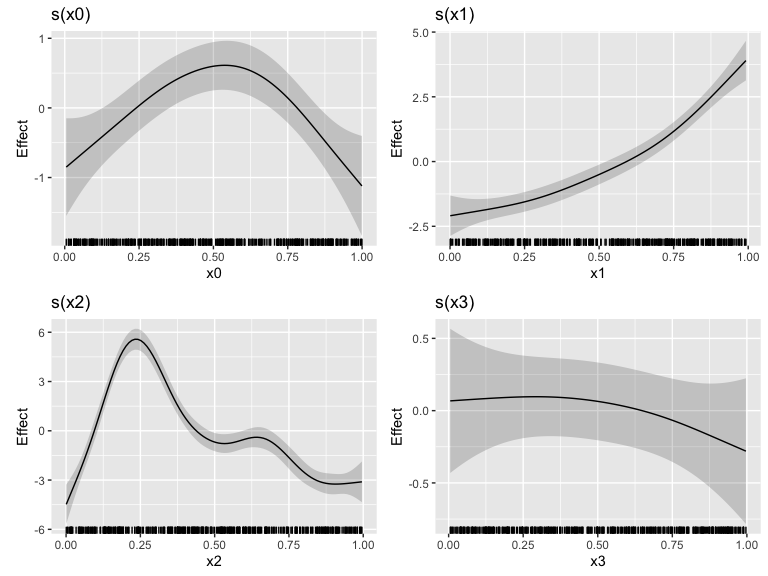
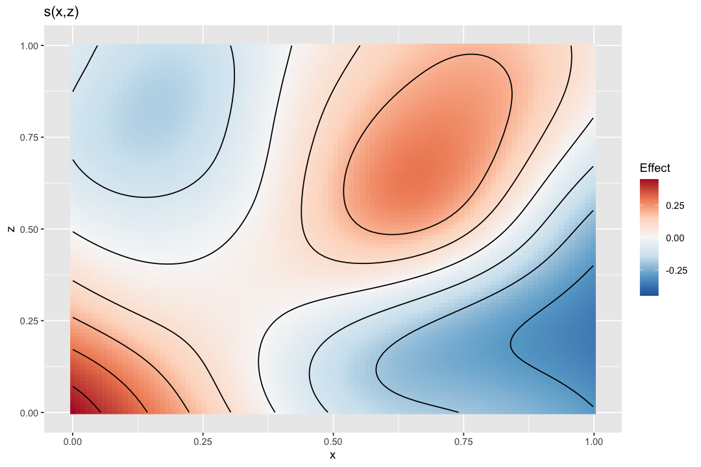
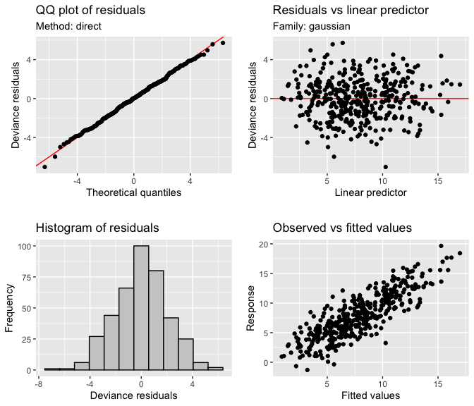

<!-- README.md is generated from README.Rmd. Please edit that file -->

# gratia

<!-- badges: start -->

[](https://github.com/gavinsimpson/gratia/actions)
[](https://app.codecov.io/gh/gavinsimpson/gratia)
[](https://cran.r-project.org/package=gratia)
[](https://cran.r-project.org/package=gratia)
[](https://doi.org/10.21105/joss.06962)
[](https://gavinsimpson.r-universe.dev/gratia)
[](https://gavinsimpson.r-universe.dev/gratia)
<!-- badges: end -->

## Overview

Working with GAMs within the ‘tidyverse’ can be tedious and even
difficult without a good understanding of GAMs themselves and how the
model is returned by ‘mgcv’ and what the model objects contain. ‘gratia’
is designed to help with this.

‘gratia’ provides ‘ggplot’-based graphics and utility functions for
working with generalized additive models (GAMs) fitted using the ‘mgcv’
package, via a reimplementation of the `plot()` method for GAMs that
‘mgcv’ provides, as well as ‘tidyverse’ compatible representations of
estimated smooths.

## Citation

If you use *gratia* in your work, please cite the package using:

Simpson, G. L., (2024). gratia: An R package for exploring generalized
additive models. *Journal of Open Source Software*, **9**(104), 6962,
<https://doi.org/10.21105/joss.06962>

## Features

The main features of *gratia* are currently

- A *ggplot2*-based replacement for `mgcv:::plot.gam()`: `draw.gam()`.

  For example, the classic four term additive example from Gu & Wahba:

  <figure>
  
  <figcaption aria-hidden="true">Estimated smooths from a GAM</figcaption>
  </figure>

  Or for a bivariate smooth:

  <figure>
  
  <figcaption aria-hidden="true">Estimated smooths from a GAM</figcaption>
  </figure>

  Note that some specialist smoothers (`bs %in% c("mrf","sw", "sf")`)
  are not currently supported, but univariate, *factor* and *continuous*
  `by`-variable smooths, simple random effect smooths (`bs = 're'`),
  factor-smooth interaction smooths (`bs = "fs"`), constrained factor
  smooths (`bs = "sz"`), full soap film smooths (`bs = "so"`), and
  bivariate, trivariate, and quadvariate TPRS and tensor product smooths
  are supported,

- Estimation of derivatives of fitted smoothers: `derivatives()`,

- Estimation of point-wise across-the-function confidence intervals and
  simultaneous intervals for smooths: `confint.gam()`.

- Model diagnostics via `appraise()`

  <figure>
  
  <figcaption aria-hidden="true">Model diagnostics figure</figcaption>
  </figure>

## Installing *gratia*

*gratia* is now available on CRAN, and can be installed with

``` r
install.packages("gratia")
```

however *gratia* is under active development and you may wish to install
the development version from github. The easiest way to do this is via
the `install_github()` function from package *remotes*. Make sure you
have *remotes* installed, then run

``` r
remotes::install_github("gavinsimpson/gratia")
```

to install the package. Alternatively, binary packages of the
development version are available from rOpenSci’s R Universe service:

``` r
# Install gratia in R
install.packages("gratia", repos = c(
  "https://gavinsimpson.r-universe.dev",
  "https://cloud.r-project.org"
))
```

## History

*gratia* grew out of an earlier package, *schoenberg*, itself a
development of the earlier package *tsgam*, which was originally
intended to be used with GAMs fitted to time series. As I was developing
*tsgam* however it became clear that the package could be used more
generally and that the name “tsgam” was no longer appropriate. To avoid
breaking blog posts I had written using *tsgam* I decided to copy the
git repo and all the history to a new repo for the package under the
name *schoenberg*. At a later date someone released another package
called *schoenberg* to CRAN, so that scuppered that idea. Now I’m
calling the package *gratia*. Hopefully I won’t have to change it again…

## Why *gratia*?

In naming his [*greta*](https://github.com/greta-dev/greta) package,
Nick Golding observed the recent phenomena of naming statistical
modelling software, such as Stan or Edward, after individuals that
played a prominent role in the development of the field. This lead Nick
to name his Tensor Flow-based package *greta* after [*Grete
Hermann*](https://greta-stats.org/articles/webpages/why_greta.html).

In the same spirit, *gratia* is named in recognition of the
contributions of [Grace
Wahba](https://en.wikipedia.org/wiki/Grace_Wahba), who did pioneering
work on the penalised spline models that are at the foundation of the
way GAMs are estimated in *mgcv*. I wanted to name the package *grace*,
to explicitly recognise Grace’s contributions, but unfortunately there
was already a package named *Grace* on CRAN. So I looked elsewhere for
inspiration.

The English word “grace” derives from the Latin *gratia*, meaning
“favor, charm, thanks” ([according to Merriam
Webster](https://www.merriam-webster.com/dictionary/grace)).

The chair that Grace Wabha currently holds is named after [Isaac J
Schoenberg](https://en.wikipedia.org/wiki/Isaac_Jacob_Schoenberg), a
former University Madison-Wisconsin Professor of Mathematics, who in a
1946 paper provided the first mathematical reference to “splines”.
(Hence the previous name for the package.)
