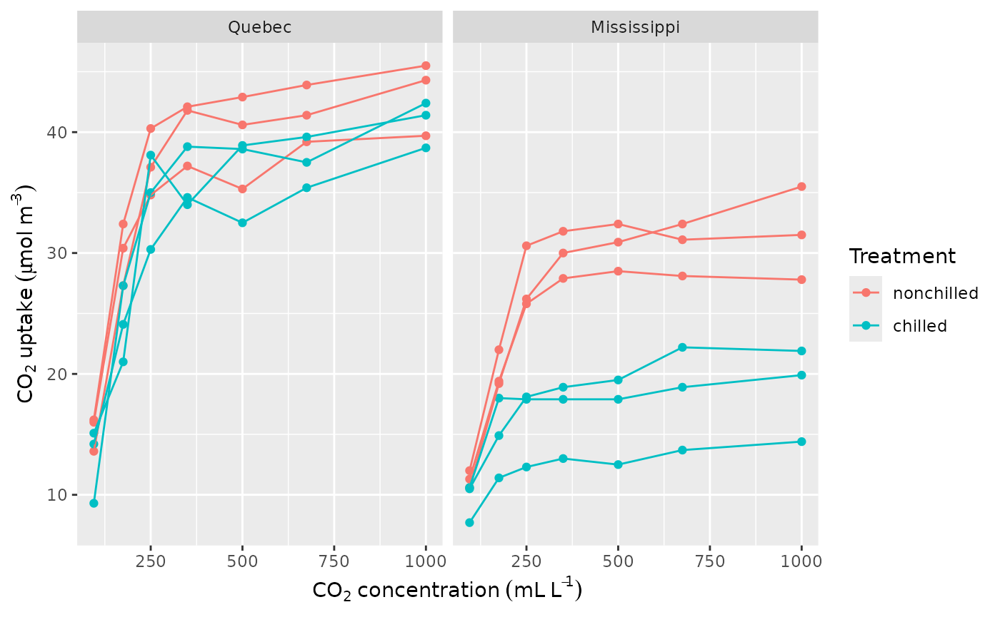
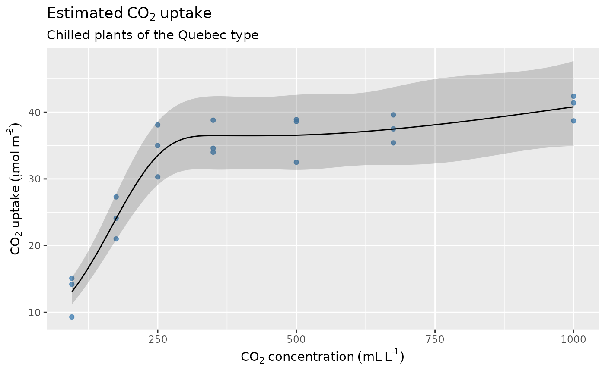

# Data slices

Having fitted a GAM or other model containing penalised splines, we
often want to evaluate the model at some pre-specified values of the
covariates. For more complex models, this will typically involve holding
some covariates at fixed, representative values while visualising the
change in the response or effect of a smooth over supplied values of one
or more other covariates. The values of the covariates at which we
evaluate a smooth or a model are called a *data slice*[¹](#fn1).

This article will explain how to create data slices with {gratia} and
its
[`data_slice()`](https://gavinsimpson.github.io/gratia/reference/data_slice.md)
function, and how to use them to visualise features of your fitted GAMs.

We’ll need the following packages for this article

``` r
library("mgcv")
#> Loading required package: nlme
#> This is mgcv 1.9-3. For overview type 'help("mgcv-package")'.
library("gratia")
library("dplyr")
#> 
#> Attaching package: 'dplyr'
#> The following object is masked from 'package:nlme':
#> 
#>     collapse
#> The following objects are masked from 'package:stats':
#> 
#>     filter, lag
#> The following objects are masked from 'package:base':
#> 
#>     intersect, setdiff, setequal, union
library("ggplot2")
library("forcats")
library("datasets")
```

## Carbon Dioxide Uptake in Grass Plants

The first example uses a small data set from an experimental study of
the cold tolerance of the grass *Echinochloa crusgalli*. The data are in
data frame `CO2` and provided with the {datasets} package that ships
with R.

``` r
## data load and prep
data(CO2, package = "datasets")
plant <- CO2 |>
  as_tibble() |>
  rename(plant = Plant, type = Type, treatment = Treatment) |>
  mutate(plant = factor(plant, ordered = FALSE))
```

``` r
plant_ylab <- expression(CO[2] ~ uptake ~ (mu * mol ~ m^{-3}))
plant_xlab <- expression(CO[2] ~ concentration ~ (mL ~ L^{-1}))

plant |>
  ggplot(aes(x = conc, y = uptake, group = plant, colour = treatment)) +
  geom_point() +
  geom_line() +
  facet_wrap(~type) +
  labs(y = plant_ylab, x = plant_xlab, colour = "Treatment")
```



One way to model these data is to allow for different smooths for all
combinations of the `treatment` and `type` covariates

``` r
plant <- plant |>
  mutate(tt = fct_cross(treatment, type))
m_plant <- gam(uptake ~ treatment * type + s(conc, by = tt, k = 6) +
    s(plant, bs = "re"),
  data = plant, method = "REML", family = Gamma(link = "log")
)
overview(m_plant)
#> 
#> Generalized Additive Model with 9 terms
#> 
#>   term                             type        k   edf ref.edf statistic p.value
#>   <chr>                            <chr>   <dbl> <dbl>   <dbl>     <dbl> <chr>  
#> 1 Intercept                        parame…    NA  1       1        53.4  < 0.001
#> 2 treatmentchilled                 parame…    NA  1       1        -1.26 0.21249
#> 3 typeMississippi                  parame…    NA  1       1        -3.35 0.00148
#> 4 treatmentchilled:typeMississippi parame…    NA  1       1        -2.73 0.00855
#> 5 s(conc):ttnonchilled:Quebec      TPRS        5  4.72    4.96     69.7  < 0.001
#> 6 s(conc):ttnonchilled:Mississippi TPRS        5  4.62    4.92     74.1  < 0.001
#> 7 s(conc):ttchilled:Quebec         TPRS        5  4.71    4.95     86.5  < 0.001
#> 8 s(conc):ttchilled:Mississippi    TPRS        5  4.39    4.81     25.3  < 0.001
#> 9 s(plant)                         Random…    12  7.40    8        12.8  < 0.001
```

We can look at the fitted smooths using
[`draw()`](https://gavinsimpson.github.io/gratia/reference/draw.md)

``` r
draw(m_plant, residuals = TRUE, scales = "fixed")
```


We might want to compare model fitted values for the treatment for each
of the types (origins), ignoring the random effect component. For this
we want to evaluate the model at a range of values of covariate `conc`
for some combinations of the other factors. This is a data slice through
the covariate space, which we can create using
[`data_slice()`](https://gavinsimpson.github.io/gratia/reference/data_slice.md).
To create a data slice for `conc` for the `Quebec` `type` in the
`chilled` `treatment` we would use

``` r
ds1 <- data_slice(m_plant,
  conc = evenly(conc, n = 100),
  type = level(type, "Quebec"), treatment = level(treatment, "chilled")
)
ds1
#> # A tibble: 100 × 5
#>     conc type   treatment tt                plant
#>    <dbl> <fct>  <fct>     <fct>             <fct>
#>  1   95  Quebec chilled   nonchilled:Quebec Qn1  
#>  2  104. Quebec chilled   nonchilled:Quebec Qn1  
#>  3  113. Quebec chilled   nonchilled:Quebec Qn1  
#>  4  122. Quebec chilled   nonchilled:Quebec Qn1  
#>  5  132. Quebec chilled   nonchilled:Quebec Qn1  
#>  6  141. Quebec chilled   nonchilled:Quebec Qn1  
#>  7  150. Quebec chilled   nonchilled:Quebec Qn1  
#>  8  159. Quebec chilled   nonchilled:Quebec Qn1  
#>  9  168. Quebec chilled   nonchilled:Quebec Qn1  
#> 10  177. Quebec chilled   nonchilled:Quebec Qn1  
#> # ℹ 90 more rows
```

Notice how
[`data_slice()`](https://gavinsimpson.github.io/gratia/reference/data_slice.md)
has filled in something for the remaining covariates that we didn’t
mention? In this case,
[`data_slice()`](https://gavinsimpson.github.io/gratia/reference/data_slice.md)
doesn’t know how `tt` was created, so it has chosen the modal level for
the `tt` factor, which is not the correct choice in this case. Instead,
we need to specify the correct level explicitly for `tt`

``` r
ds1 <- data_slice(m_plant,
  conc = evenly(conc, n = 100),
  treatment = level(treatment, "chilled"), type = level(type, "Quebec"),
  tt = level(tt, "chilled:Quebec")
)
ds1
#> # A tibble: 100 × 5
#>     conc treatment type   tt             plant
#>    <dbl> <fct>     <fct>  <fct>          <fct>
#>  1   95  chilled   Quebec chilled:Quebec Qn1  
#>  2  104. chilled   Quebec chilled:Quebec Qn1  
#>  3  113. chilled   Quebec chilled:Quebec Qn1  
#>  4  122. chilled   Quebec chilled:Quebec Qn1  
#>  5  132. chilled   Quebec chilled:Quebec Qn1  
#>  6  141. chilled   Quebec chilled:Quebec Qn1  
#>  7  150. chilled   Quebec chilled:Quebec Qn1  
#>  8  159. chilled   Quebec chilled:Quebec Qn1  
#>  9  168. chilled   Quebec chilled:Quebec Qn1  
#> 10  177. chilled   Quebec chilled:Quebec Qn1  
#> # ℹ 90 more rows
```

Having created the data slice, we can predict from the model using the
combination of covariate values specified in our slice. We could use
[`predict.gam()`](https://rdrr.io/pkg/mgcv/man/predict.gam.html) for
this, but the
[`fitted_values()`](https://gavinsimpson.github.io/gratia/reference/fitted_values.md)
function in {gratia} is easier to use, especially for non-Gaussian
models

``` r
fv1 <- fitted_values(m_plant, data = ds1, scale = "response", exclude = "s(plant)")
fv1
#> # A tibble: 100 × 10
#>     .row  conc treatment type   tt      plant .fitted    .se .lower_ci .upper_ci
#>    <int> <dbl> <fct>     <fct>  <fct>   <fct>   <dbl>  <dbl>     <dbl>     <dbl>
#>  1     1   95  chilled   Quebec chille… Qn1      13.0 0.0783      11.2      15.2
#>  2     2  104. chilled   Quebec chille… Qn1      14.1 0.0757      12.1      16.3
#>  3     3  113. chilled   Quebec chille… Qn1      15.2 0.0737      13.1      17.5
#>  4     4  122. chilled   Quebec chille… Qn1      16.3 0.0722      14.2      18.8
#>  5     5  132. chilled   Quebec chille… Qn1      17.6 0.0714      15.3      20.2
#>  6     6  141. chilled   Quebec chille… Qn1      18.9 0.0711      16.4      21.7
#>  7     7  150. chilled   Quebec chille… Qn1      20.2 0.0712      17.6      23.3
#>  8     8  159. chilled   Quebec chille… Qn1      21.6 0.0716      18.8      24.9
#>  9     9  168. chilled   Quebec chille… Qn1      23.0 0.0721      20.0      26.5
#> 10    10  177. chilled   Quebec chille… Qn1      24.4 0.0726      21.2      28.1
#> # ℹ 90 more rows
```

Notice how we excluded the random effect term; even though we had to
specify something for the `plant` covariate we can ignore this term in
the model using the `exclude` argument.
[`fitted_values()`](https://gavinsimpson.github.io/gratia/reference/fitted_values.md)
creates the credible interval on the scale of the link function and then
back-transforms to the response scale when `scale = "response"`, which
is also the default.

Plotting the fitted values for the data slice now only requires some
simple {ggplot2} knowledge

``` r
fv1 |>
  ggplot(aes(x = conc, y = .fitted)) +
  geom_point(
    data = plant |>
      filter(type == "Quebec", treatment == "chilled"),
    mapping = aes(y = uptake),
    alpha = 0.8, colour = "steelblue"
  ) +
  geom_ribbon(aes(ymin = .lower_ci, ymax = .upper_ci), alpha = 0.2) +
  geom_line() +
  labs(
    x = plant_xlab, y = plant_ylab,
    title = expression(Estimated ~ CO[2] ~ uptake),
    subtitle = "Chilled plants of the Quebec type"
  )
```



Next, let’s compare the fitted effects of the treatment in the
Mississippi origin plants

``` r
ds2 <- data_slice(m_plant,
  conc = evenly(conc, n = 100),
  treatment = evenly(treatment), type = level(type, "Mississippi")
) |>
  mutate(tt = fct_cross(treatment, type, keep_empty = TRUE))
ds2
#> # A tibble: 200 × 5
#>     conc treatment  type        tt                     plant
#>    <dbl> <fct>      <fct>       <fct>                  <fct>
#>  1   95  nonchilled Mississippi nonchilled:Mississippi Qn1  
#>  2   95  chilled    Mississippi chilled:Mississippi    Qn1  
#>  3  104. nonchilled Mississippi nonchilled:Mississippi Qn1  
#>  4  104. chilled    Mississippi chilled:Mississippi    Qn1  
#>  5  113. nonchilled Mississippi nonchilled:Mississippi Qn1  
#>  6  113. chilled    Mississippi chilled:Mississippi    Qn1  
#>  7  122. nonchilled Mississippi nonchilled:Mississippi Qn1  
#>  8  122. chilled    Mississippi chilled:Mississippi    Qn1  
#>  9  132. nonchilled Mississippi nonchilled:Mississippi Qn1  
#> 10  132. chilled    Mississippi chilled:Mississippi    Qn1  
#> # ℹ 190 more rows
```

Here, we replaced the automatically-generated `tt` variable with the
correctly specified call to
[`fct_cross()`](https://forcats.tidyverse.org/reference/fct_cross.html),
retaining the levels of the `type` and `treatment` factors. This insures
that we have the correct combinations corresponding to the `treatment`
and `type` factors but also that we preserve the original levels of the
`tt` covariate we created.

We can again visualise the fitted values for this data slice

``` r
fitted_values(m_plant,
  data = ds2, scale = "response",
  exclude = "s(plant)"
) |>
  ggplot(aes(x = conc, y = .fitted, group = treatment)) +
  geom_point(
    data = plant |> filter(type == "Mississippi"),
    mapping = aes(y = uptake, colour = treatment),
    alpha = 0.8
  ) +
  geom_ribbon(aes(ymin = .lower_ci, ymax = .upper_ci, fill = treatment),
    alpha = 0.2
  ) +
  geom_line(aes(colour = treatment)) +
  labs(
    x = plant_xlab, y = plant_ylab,
    title = expression(Estimated ~ CO[2] ~ uptake),
    subtitle = "Comparison of treatment in plants of the Mississippi type",
    colour = "Treatment", fill = "Treatment"
  )
```


When we were creating our data slices, we used some helper functions to
specify covariate values for the slice. {gratia} provides several such
helper functions:

- `evenly(x, n = 100)` — creates `n` evenly spaced values over the range
  of the covariate,
- `evenly(x, by = 5` — creates evenly spaced values over the range of
  the covariate in increments of 5,
- `evenly(x, ..., lower = 5, upper = 10)` — either of the two uses of
  [`evenly()`](https://gavinsimpson.github.io/gratia/reference/evenly.md)
  shown above will use the lower and upper limits of the vector `x`.
  Arguments `lower` and `upper` can be used to change one or both of the
  upper or lower bounds.
- `evenly(fct)` — produces a new factor containing each level of the
  specified factor `fct` just once,
- `ref_level(fct)` — creates a new factor containing just the reference
  level of the specified factor covariate `fct`, and
- `level(fct, "level")` — creates a factor with requested `"level"` from
  the factor `fct`.

In all cases involving factors, the helper functions set the levels of
the factor to match those in the original model fit[²](#fn2).

The second argument to
[`data_slice()`](https://gavinsimpson.github.io/gratia/reference/data_slice.md)
is `...`

``` r
args(gratia:::data_slice.gam)
#> function (object, ..., data = NULL, envir = NULL, .observed_only = FALSE) 
#> NULL
```

The `...` argument allows you to provide expressions to create the
covariate values you want for your data slice. Expressions passed to
`...` are evaluated within the model frame of the fitted model (argument
`object`) or in `data` (if supplied). You are not restricted either to
using only the helper functions provide by {gratia}; any R function
could be used as long as it makes sense in the context of the model
frame, and it returns something that can be combined using
[`tidyr::expand_grid()`](https://tidyr.tidyverse.org/reference/expand_grid.html).

## Slices through a 2D smooth

In the second example, I’ll use the bivariate example data set from
{mgcv} but fit a tensor product of covariates `x` and `z`

``` r
# simulate data from the bivariate surface
df <- data_sim("eg2", n = 1000, scale = 0.25, seed = 2)

# fit the GAM
m_biv <- gam(y ~ te(x, z), data = df, method = "REML")
```

The aim of the example will be to create a univariate data slice through
the 2D smooth at user-specified values of `x` while holding `z` at one
or more fixed values. We could visualise the effect at the smooth level,
using
[`smooth_estimates()`](https://gavinsimpson.github.io/gratia/reference/smooth_estimates.md),
or at the response level, as we did above using
[`fitted_values()`](https://gavinsimpson.github.io/gratia/reference/fitted_values.md).

### Using `smooth_estimates()`

We begin by creating a slice through the data space. We also create a
label at this point for a nice axis label.

``` r
ds3 <- data_slice(m_biv,
  x = evenly(x, n = 100),
  z = quantile(z, probs = 0.25)
)

z_val <- with(ds3, round(quantile(z, probs = 0.25), 2))
ylab <- bquote(hat(f)(x, .(z_val)))
```

Then we evaluate the smooth at the desired values and add a confidence
interval

``` r
sm <- smooth_estimates(m_biv, select = "te(x,z)", data = ds3) |>
  add_confint()
sm
#> # A tibble: 100 × 9
#>    .smooth .type        .by   .estimate    .se       x     z .lower_ci .upper_ci
#>    <chr>   <chr>        <chr>     <dbl>  <dbl>   <dbl> <dbl>     <dbl>     <dbl>
#>  1 te(x,z) Tensor prod… NA        0.103 0.0583 6.63e-4 0.245   -0.0107     0.218
#>  2 te(x,z) Tensor prod… NA        0.122 0.0548 1.08e-2 0.245    0.0148     0.230
#>  3 te(x,z) Tensor prod… NA        0.141 0.0514 2.08e-2 0.245    0.0400     0.242
#>  4 te(x,z) Tensor prod… NA        0.159 0.0482 3.09e-2 0.245    0.0648     0.254
#>  5 te(x,z) Tensor prod… NA        0.177 0.0451 4.10e-2 0.245    0.0890     0.266
#>  6 te(x,z) Tensor prod… NA        0.195 0.0422 5.11e-2 0.245    0.113      0.278
#>  7 te(x,z) Tensor prod… NA        0.213 0.0396 6.12e-2 0.245    0.135      0.291
#>  8 te(x,z) Tensor prod… NA        0.230 0.0372 7.13e-2 0.245    0.157      0.303
#>  9 te(x,z) Tensor prod… NA        0.247 0.0351 8.14e-2 0.245    0.178      0.316
#> 10 te(x,z) Tensor prod… NA        0.263 0.0333 9.14e-2 0.245    0.198      0.328
#> # ℹ 90 more rows
```

We can plot `sm` using {ggplot2}

``` r
sm |>
  ggplot(aes(x = x, y = .estimate)) +
  geom_ribbon(aes(ymin = .lower_ci, ymax = .upper_ci), alpha = 0.2) +
  geom_line() +
  labs(
    title = "Evaluation of smooth te(x,z) at fixed z",
    y = ylab
  )
```


Note that the above interval is not the Marra and Wood (2012) interval.
It doesn’t include the uncertainty from the model constant term at the
moment, but unless the smooth is very close to linear that shouldn’t
make too much difference.

This extends to multiple slices by asking for several discrete `z`

``` r
ds4 <- data_slice(m_biv,
  x = evenly(x, n = 100),
  z = round(quantile(z, probs = c(0.25, 0.5, 0.75)), 2)
)

sm <- smooth_estimates(m_biv, select = "te(x,z)", data = ds4) |>
  add_confint() |>
  mutate(fz = factor(z))

sm |>
  ggplot(aes(x = x, y = .estimate, colour = fz, group = fz)) +
  geom_ribbon(aes(ymin = .lower_ci, ymax = .upper_ci, fill = fz, colour = NULL),
    alpha = 0.2
  ) +
  geom_line() +
  labs(
    title = "Evaluation of smooth te(x,z) at fixed z",
    y = expression(hat(f)(x, z)), colour = "z", fill = "z"
  )
```


### Using `fitted_samples()`

If you want to evaluate the surface over `x` at fixed `z` conditional
upon other values of other covariates (model predicted or fitted values)
then
[`fitted_samples()`](https://gavinsimpson.github.io/gratia/reference/fitted_samples.md)
is a tidy wrapper to
[`predict.gam()`](https://rdrr.io/pkg/mgcv/man/predict.gam.html).

For single `z` we have

``` r
fitted_values(m_biv, data = ds3) |> # default is response scale, not link
  ggplot(aes(x = x, y = .fitted)) +
  geom_ribbon(aes(ymin = .lower_ci, ymax = .upper_ci), alpha = 0.2) +
  geom_line() +
  labs(
    title = "Fitted values from model",
    y = expression(hat(y))
  )
```


And for the multiple `z` we have

``` r
fitted_values(m_biv, data = ds4) |>
  mutate(fz = factor(z)) |>
  ggplot(aes(x = x, y = .fitted, colour = fz, group = fz)) +
  geom_ribbon(aes(ymin = .lower_ci, ymax = .upper_ci, fill = fz, colour = NULL),
    alpha = 0.2
  ) +
  geom_line() +
  labs(
    title = "Fitted values from model",
    y = expression(hat(y)), colour = "z", fill = "z"
  )
```


where the only difference here is that now the model constant is
included as well as its uncertainty.

------------------------------------------------------------------------

1.  at least that’s what I’m calling them.

2.  Depending on the value of argument `drop.unused.levels` passed to
    [`gam()`](https://rdrr.io/pkg/mgcv/man/gam.html) when you fitted the
    model. The default will drop any unused levels before fitting the
    model, and as a result the helpers will not include those levels
    either.
