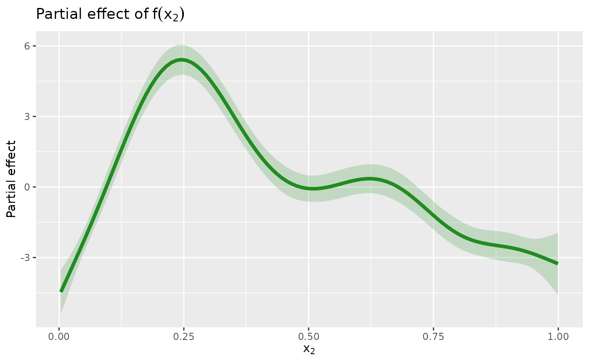

# Getting started with gratia

``` r
library("gratia")
library("mgcv")
#> Loading required package: nlme
#> This is mgcv 1.9-3. For overview type 'help("mgcv-package")'.
```

gratia is a package to make working with generalized additive models
(GAMs) in R easier, including producing plots of estimated smooths using
the ggplot2 📦.

This introduction will cover some of the basic functionality of gratia
to get you started. We’ll work with some classic simulated data often
used to illustrate properties of GAMs

``` r
df <- data_sim("eg1", seed = 42)
df
#> # A tibble: 400 × 10
#>        y    x0     x1    x2    x3     f    f0    f1     f2    f3
#>    <dbl> <dbl>  <dbl> <dbl> <dbl> <dbl> <dbl> <dbl>  <dbl> <dbl>
#>  1  2.99 0.915 0.0227 0.909 0.402  1.62 0.529  1.05 0.0397     0
#>  2  4.70 0.937 0.513  0.900 0.432  3.25 0.393  2.79 0.0630     0
#>  3 13.9  0.286 0.631  0.192 0.664 13.5  1.57   3.53 8.41       0
#>  4  5.71 0.830 0.419  0.532 0.182  6.12 1.02   2.31 2.79       0
#>  5  7.63 0.642 0.879  0.522 0.838 10.4  1.80   5.80 2.76       0
#>  6  9.80 0.519 0.108  0.160 0.917 10.4  2.00   1.24 7.18       0
#>  7 10.4  0.737 0.980  0.520 0.798 11.3  1.47   7.10 2.75       0
#>  8 12.8  0.135 0.265  0.225 0.503 11.4  0.821  1.70 8.90       0
#>  9 13.8  0.657 0.0843 0.282 0.254 11.1  1.76   1.18 8.20       0
#> 10  7.51 0.705 0.386  0.504 0.667  6.50 1.60   2.16 2.74       0
#> # ℹ 390 more rows
```

and the following GAM

``` r
m <- gam(y ~ s(x0) + s(x1) + s(x2) + s(x3), data = df, method = "REML")
summary(m)
#> 
#> Family: gaussian 
#> Link function: identity 
#> 
#> Formula:
#> y ~ s(x0) + s(x1) + s(x2) + s(x3)
#> 
#> Parametric coefficients:
#>             Estimate Std. Error t value Pr(>|t|)    
#> (Intercept)   7.4951     0.1051   71.35   <2e-16 ***
#> ---
#> Signif. codes:  0 '***' 0.001 '**' 0.01 '*' 0.05 '.' 0.1 ' ' 1
#> 
#> Approximate significance of smooth terms:
#>         edf Ref.df      F  p-value    
#> s(x0) 3.425  4.244  8.828 8.78e-07 ***
#> s(x1) 3.221  4.003 67.501  < 2e-16 ***
#> s(x2) 7.905  8.685 67.766  < 2e-16 ***
#> s(x3) 1.885  2.359  2.642   0.0636 .  
#> ---
#> Signif. codes:  0 '***' 0.001 '**' 0.01 '*' 0.05 '.' 0.1 ' ' 1
#> 
#> R-sq.(adj) =  0.685   Deviance explained = 69.8%
#> -REML = 886.93  Scale est. = 4.4144    n = 400
```

### Plotting

gratia provides the
[`draw()`](https://gavinsimpson.github.io/gratia/reference/draw.md)
function to produce plots using the ggplot2 📦. To plot the estimated
smooths from the GAM we fitted above, use

``` r
draw(m)
```


The plots produced are *partial effect* plots, which show the component
contributions, on the link scale, of each model term to the linear
predictor. The y axis on these plots is typically centred around 0 due
to most smooths having a sum-to-zero identifiability constraint applied
to them. This constraint is what allows the model to include multiple
smooths and remain identifiable. These plots allow you to read off the
contributions of each smooth to the fitted response (on the link scale);
they show link-scale predictions of the response for each smooth,
conditional upon all other terms in the model, including any parametric
effects and the intercept, having zero contribution. In the parlance of
the marginaleffects package (Arel-Bundock, Greifer, and Heiss
Forthcoming), these plots show adjusted predictions, just where the
adjustment includes setting the contribution of all other model terms to
the predicted value to zero. For partial derivatives (what
*marginaleffects* would call a marginal effect or slope), gratia
provides
[`derivatives()`](https://gavinsimpson.github.io/gratia/reference/derivatives.md).

The resulting plot is intended as reasonable overview of the estimated
model, but it offers limited option to modify the resulting plot. If you
want full control, you can obtain the data used to create the plot above
with
[`smooth_estimates()`](https://gavinsimpson.github.io/gratia/reference/smooth_estimates.md)

``` r
sm <- smooth_estimates(m)
sm
#> # A tibble: 400 × 9
#>    .smooth .type .by   .estimate   .se       x0    x1    x2    x3
#>    <chr>   <chr> <chr>     <dbl> <dbl>    <dbl> <dbl> <dbl> <dbl>
#>  1 s(x0)   TPRS  NA       -1.32  0.390 0.000239    NA    NA    NA
#>  2 s(x0)   TPRS  NA       -1.24  0.365 0.0103      NA    NA    NA
#>  3 s(x0)   TPRS  NA       -1.17  0.340 0.0204      NA    NA    NA
#>  4 s(x0)   TPRS  NA       -1.09  0.318 0.0304      NA    NA    NA
#>  5 s(x0)   TPRS  NA       -1.02  0.297 0.0405      NA    NA    NA
#>  6 s(x0)   TPRS  NA       -0.947 0.279 0.0506      NA    NA    NA
#>  7 s(x0)   TPRS  NA       -0.875 0.263 0.0606      NA    NA    NA
#>  8 s(x0)   TPRS  NA       -0.803 0.249 0.0707      NA    NA    NA
#>  9 s(x0)   TPRS  NA       -0.732 0.237 0.0807      NA    NA    NA
#> 10 s(x0)   TPRS  NA       -0.662 0.228 0.0908      NA    NA    NA
#> # ℹ 390 more rows
```

which will evaluate all smooths at values that are evenly spaced over
the range of the covariate(s). If you want to evaluate only selected
smooths, you can specify which via the `smooth` argument. This takes the
*smooth labels* which are the names of the smooths as they are known to
mgcv. To list the labels for the smooths in use

``` r
smooths(m)
#> [1] "s(x0)" "s(x1)" "s(x2)" "s(x3)"
```

To evaluate only $f\left( x_{2} \right)$ use

``` r
sm <- smooth_estimates(m, smooth = "s(x2)")
#> Warning: The `smooth` argument of `smooth_estimates()` is deprecated as of gratia
#> 0.8.9.9.
#> ℹ Please use the `select` argument instead.
#> This warning is displayed once every 8 hours.
#> Call `lifecycle::last_lifecycle_warnings()` to see where this warning was
#> generated.
sm
#> # A tibble: 100 × 6
#>    .smooth .type .by   .estimate   .se      x2
#>    <chr>   <chr> <chr>     <dbl> <dbl>   <dbl>
#>  1 s(x2)   TPRS  NA      -4.47   0.476 0.00359
#>  2 s(x2)   TPRS  NA      -4.00   0.406 0.0136 
#>  3 s(x2)   TPRS  NA      -3.53   0.345 0.0237 
#>  4 s(x2)   TPRS  NA      -3.06   0.295 0.0338 
#>  5 s(x2)   TPRS  NA      -2.58   0.263 0.0438 
#>  6 s(x2)   TPRS  NA      -2.09   0.250 0.0539 
#>  7 s(x2)   TPRS  NA      -1.59   0.253 0.0639 
#>  8 s(x2)   TPRS  NA      -1.08   0.264 0.0740 
#>  9 s(x2)   TPRS  NA      -0.564  0.278 0.0841 
#> 10 s(x2)   TPRS  NA      -0.0364 0.289 0.0941 
#> # ℹ 90 more rows
```

Then you can generate your own plot using the ggplot2 package, for
example

``` r
library("ggplot2")
library("dplyr")
#> 
#> Attaching package: 'dplyr'
#> The following object is masked from 'package:nlme':
#> 
#>     collapse
#> The following objects are masked from 'package:stats':
#> 
#>     filter, lag
#> The following objects are masked from 'package:base':
#> 
#>     intersect, setdiff, setequal, union
sm |>
  add_confint() |>
  ggplot(aes(y = .estimate, x = x2)) +
  geom_ribbon(aes(ymin = .lower_ci, ymax = .upper_ci),
    alpha = 0.2, fill = "forestgreen"
  ) +
  geom_line(colour = "forestgreen", linewidth = 1.5) +
  labs(
    y = "Partial effect",
    title = expression("Partial effect of" ~ f(x[2])),
    x = expression(x[2])
  )
```



### Model diagnostics

The
[`appraise()`](https://gavinsimpson.github.io/gratia/reference/appraise.md)
function provides standard diagnostic plots for GAMs

``` r
appraise(m)
```


The plots produced are (from left-to-right, top-to-bottom),

- a quantile-quantile (QQ) plot of deviance residuals,
- a scatterplot of deviance residuals against the linear predictor,
- a histogram of deviance residuals, and
- a scatterplot of observed vs fitted values.

Adding partial residuals to the partial effect plots produced by
[`draw()`](https://gavinsimpson.github.io/gratia/reference/draw.md) can
also help diagnose problems with the model, such as oversmoothing

``` r
draw(m, residuals = TRUE)
```


### Want to learn more?

*gratia* is in very active development and an area of development that
is currently lacking is documentation. To find out more about the
package, look at the [help pages for the
package](https://gavinsimpson.github.io/gratia/reference/index.html) and
look at the examples for more code to help you get going.

## References

Arel-Bundock, Vincent, Noah Greifer, and Andrew Heiss. Forthcoming. “How
to Interpret Statistical Models Using marginaleffects in R and Python.”
*Journal of Statistical Software*, Forthcoming.
