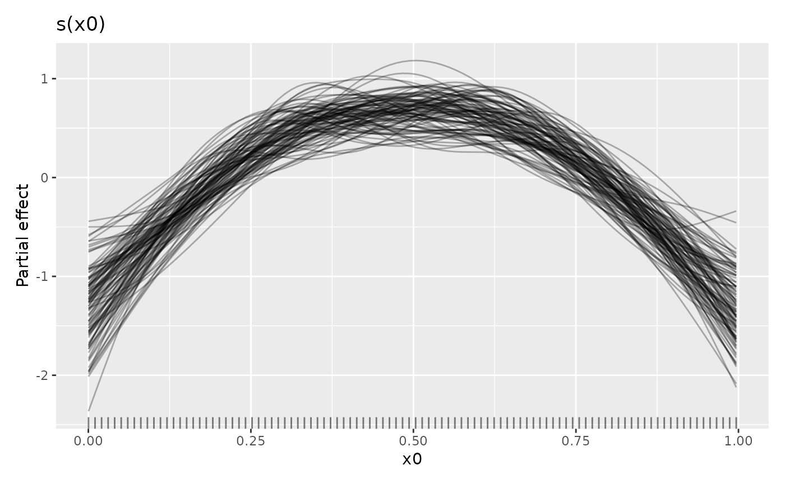
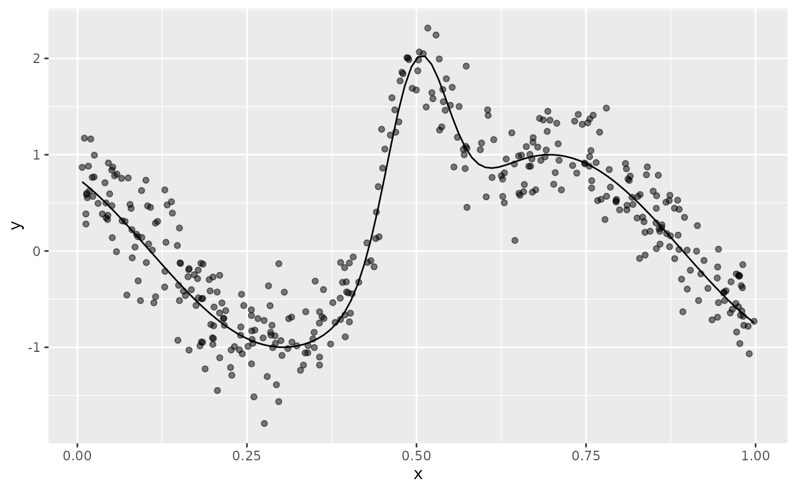
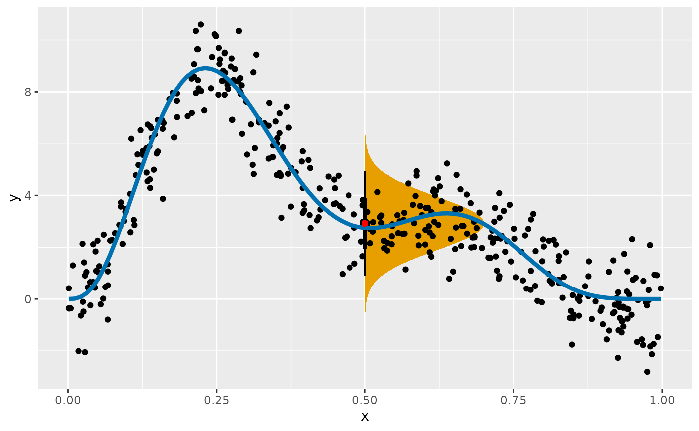
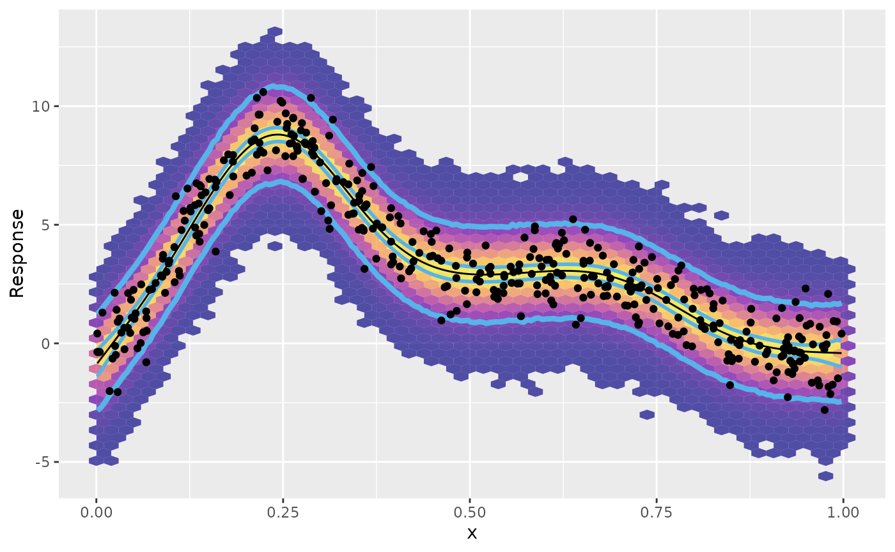
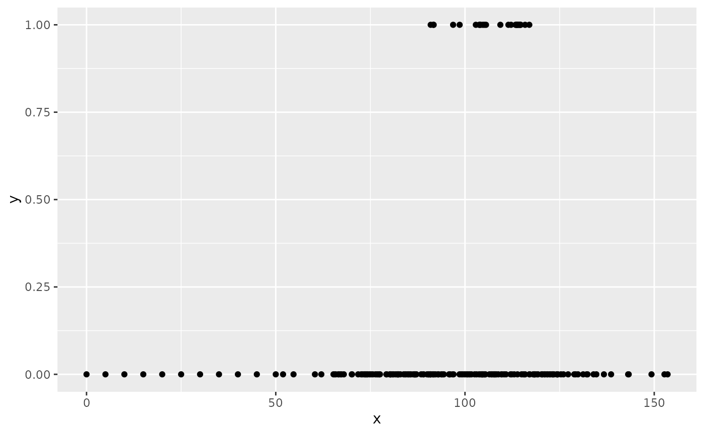

# Posterior Simulation

This vignette describes *gratia*’s tools for posterior simulation, a
powerful way of doing inference using estimated generalized additive
models.

We’ll need the following packages for this vignette:

``` r
pkgs <- c(
  "mgcv", "gratia", "dplyr", "tidyr", "ggplot2", "ggdist",
  "distributional", "tibble", "withr", "patchwork", "ggokabeito"
)
vapply(pkgs, library, logical(1L), logical.return = TRUE, character.only = TRUE)
#>           mgcv         gratia          dplyr          tidyr        ggplot2 
#>           TRUE           TRUE           TRUE           TRUE           TRUE 
#>         ggdist distributional         tibble          withr      patchwork 
#>           TRUE           TRUE           TRUE           TRUE           TRUE 
#>     ggokabeito 
#>           TRUE
```

A generalized additive model (GAM) has the following form

$$g\left( \mu_{i} \right) = \eta_{i} = A_{i} + \mathbf{X}_{i}{\mathbf{γ}} + \sum\limits_{j = 1}^{J}f_{j}\left( x_{ij} \right),\; y_{i} \sim \mathcal{D}\left( \mu_{i},\phi \right)$$

where $g{()}$ is the link function, $A$ is an offset, $\mathbf{X}_{i}$
is the $i$th row of a parametric model matrix, $\mathbf{γ}$ is a vector
of parameters for the parametric terms, $f_{j}$ is a smooth function of
covariate $x_{j}$. $y_{i} \sim \mathcal{D}\left( \mu_{i},\phi \right)$
denotes that the observations $y_{i}$ are distributed as some member of
the exponential family of distributions with mean $\mu_{i}$ and scale
parameter $\phi$.

The smooth functions $f_{j}$ are represented in the model via penalised
splines basis expansions of the covariates, that are a weighted sum of
basis functions

$$f_{j}\left( x_{ij} \right) = \sum\limits_{k = 1}^{K}\beta_{jk}b_{jk}\left( x_{ij} \right)$$

where $\beta_{jk}$ is the weight (coefficient) associated with the $k$th
basis function $b_{jk}{()}$ evaluated at the covariate value $x_{ij}$
for the $j$th smooth function $f_{j}$. Wiggliness penalties
$\sum_{j}\lambda_{j}{\mathbf{β}}^{\mathsf{T}}\mathbf{S}_{j}{\mathbf{β}}$
controls the degree of smoothing applied to the $f_{j}$ through the
smoothing parameters $\lambda_{j}$.

Having fitted the GAM in mgcv using REML or ML smoothness selection we
obtain a vector of coefficients $\widehat{\mathbf{β}}$ (which also
includes the coefficients for the parametric terms, , for convenience).
The estimates of these coefficients are conditional upon the data and
the selected values of the smoothing parameters $\lambda_{j}$. Using the
Bayesian view of smoothing (Miller, 2025) via (RE)ML smoothness
selection, $\mathbf{β}$ has a multivariate normal posterior distribution
${\mathbf{β}}|{\mathbf{η}},{\mathbf{λ}} \sim \text{MVN}\left( \widehat{\mathbf{β}},\mathbf{V}_{\text{b}} \right)$,
where $\mathbf{V}_{\text{b}}$ is the Bayesian covariance matrix of the
estimated parameters ($\widehat{\mathbf{β}}$) — the subscript $\text{b}$
is used to differentiate this Bayesian covariance matrix from the
frequentist version which is also available in the mgcv model output.

## What are we simulating?

Posterior simulation involves randomly sampling from
$\text{MVN}\left( \widehat{\mathbf{β}},\mathbf{V}_{\text{b}} \right)$ or
$\mathcal{D}\left( \mu_{i},\phi \right)$, or both.

We might simulate from the posterior distribution of a single estimated
smooth function to see the uncertainty in the estimate of that function.
To do this we simulate for just a subset of $\mathbf{β}$, $\beta_{j}$,
associated with the $f_{j}$ of interest. Instead, we might be interested
in the uncertainty in the expectation (expected value) of the model at
some given values of the covariates, in which case we can simulate for
all $\mathbf{β}$ to sample from the posterior of
${\mathbb{E}}\left( y_{i} \right)$, the fitted values of the model. Or
we might want to generate new values of response variable via draws from
the conditional distribution of the response, by simulating new response
data $\mathbf{y}^{*}$, at either the observed $\mathbf{x}$ or new values
$\mathbf{x}^{*}$, from
$y_{i}^{*}|{\mathbf{η}},\mathbf{x} \sim \mathcal{D}\left( \widehat{\mu_{i}},\phi \right)$.
Finally, we can combine posterior simulation from both distributions to
generate posterior draws for new data ${\mathbb{y}}^{*}$ that also
include the uncertainty in the expected values.

gratia has functionality for all these options through the following
functions

1.  [`smooth_samples()`](https://gavinsimpson.github.io/gratia/reference/smooth_samples.md)
    generates draws from the posterior distribution of single estimated
    smooth functions,
2.  [`fitted_samples()`](https://gavinsimpson.github.io/gratia/reference/fitted_samples.md)
    generates draws from the posterior distribution of
    ${\mathbb{E}}\left( y_{i}|\mathbf{X}_{i} = x_{i} \right)$, the
    expected value of the response,
3.  [`predicted_samples()`](https://gavinsimpson.github.io/gratia/reference/predicted_samples.md)
    generates new response data given supplied values of covariates
    $y_{i}^{*}|\mathbf{X}_{i} = x_{i}^{*}$
4.  [`posterior_samples()`](https://gavinsimpson.github.io/gratia/reference/posterior_samples.md),
    generates draws from the posterior distribution of the model,
    including the uncertainty in the estimated parameters of that model.

In simpler terms,
[`fitted_samples()`](https://gavinsimpson.github.io/gratia/reference/fitted_samples.md)
generates predictions about the “average” or expected value of the
response at values of the covariates. These predictions only include the
uncertainty in the estimated values of the model coefficients. In
contrast,
[`posterior_samples()`](https://gavinsimpson.github.io/gratia/reference/posterior_samples.md)
generates predictions of the actual values of the response we might
expect to observe (if the model is correct) given values of the
covariates. These predicted values include the variance of the sampling
distribution (error term).
[`predicted_samples()`](https://gavinsimpson.github.io/gratia/reference/predicted_samples.md)
lies somewhere in between these two; the predicted values only include
the variation in the sampling distribution, and take the model as fixed,
known.

It is worth reminding ourselves that these posterior draws are all
conditional upon the selected values of the smoothing parameter(s)
$\lambda_{j}$. We act as if the wiggliness of the estimated smooths was
known, when in actual fact we estimated (selected is perhaps a better
description) these wiglinesses from the data during model fitting. If
the estimated GAM has been fitted with `method` argument `"REML"`, or
`"ML"`, then a version of $\mathbf{V}_{\text{b}}$ that is corrected for
having selected smoothing parameters, $\mathbf{V}_{\text{c}}$, is
generally available. This allows, to an extent, for posterior simulation
to account for the additional source of uncertainty of having chosen
then values of $\mathbf{λ}$.

There are two additional functions available in gratia that do posterior
simulation:

- [`simulate()`](https://rdrr.io/r/stats/simulate.html), and
- [`derivative_samples()`](https://gavinsimpson.github.io/gratia/reference/derivative_samples.md).

gratia provides [`simulate()`](https://rdrr.io/r/stats/simulate.html)
methods for models estimated using
[`gam()`](https://rdrr.io/pkg/mgcv/man/gam.html),
[`bam()`](https://rdrr.io/pkg/mgcv/man/bam.html), and
[`gamm()`](https://rdrr.io/pkg/mgcv/man/gamm.html), as well as those
fitted via `scam()` in the scam package.
[`simulate()`](https://rdrr.io/r/stats/simulate.html) is a base R
convention that does the same thing as
[`predicted_samples()`](https://gavinsimpson.github.io/gratia/reference/predicted_samples.md),
just in a non-tidy way (that is not pejorative; it returns the simulated
response values as a matrix, which is arguably more useful if you are
doing math or further statistical computation.)
[`derivative_samples()`](https://gavinsimpson.github.io/gratia/reference/derivative_samples.md)
provides draws from the posterior distribution of the derivative of
response variable for a small change in a focal covariate value.
[`derivative_samples()`](https://gavinsimpson.github.io/gratia/reference/derivative_samples.md)
is a less general version of
[`fitted_samples()`](https://gavinsimpson.github.io/gratia/reference/fitted_samples.md);
you could achieve the same thing by two separate calls to
[`fitted_samples()`](https://gavinsimpson.github.io/gratia/reference/fitted_samples.md).
We’ll reserve discussion of
[`derivative_samples()`](https://gavinsimpson.github.io/gratia/reference/derivative_samples.md)
to a separate vignette focused on estimating derivatives from GAMs.

In the following sections we’ll look at each of the four main posterior
simulation functions in turn.

## Posterior smooths and `smooth_samples()`

We can sample from the posterior distribution of the coefficients of a
particular smooth ${\widehat{\beta}}_{j}$ given the values of the
smoothing parameters $\widehat{\mathbf{λ}}$. We generate posterior
samples of smooths by sampling
${\mathbf{β}}_{j \star} \sim N\left( {\widehat{\beta}}_{j},\mathbf{V}_{{\widehat{\beta}}_{j}} \right)$
and forming
$\mathbf{X}_{{\widehat{\mathbf{β}}}_{j}}{\mathbf{β}}_{j \star}^{\mathsf{T}}$.
This sampling can be done using
[`smooth_samples()`](https://gavinsimpson.github.io/gratia/reference/smooth_samples.md).

To illustrate this, we’ll simulate data from Gu & Wahba’s 4 smooth
example, and fit a GAM to the simulated data

``` r
ss_df <- data_sim("eg1", seed = 42)
m_ss <- gam(y ~ s(x0) + s(x1) + s(x2) + s(x3), data = ss_df, method = "REML")
```

When we are simulating from the posterior distribution of an estimated
smooth, we are only sampling from the coefficients of the particular
smooth. In this model, the coefficients for the smooth
$f\left( x_{0} \right)$ are stored as elements 2 through 10 of the
coefficients vector.

``` r
s_x0 <- get_smooth(m_ss, "s(x0)")
smooth_coef_indices(s_x0)
#> [1]  2  3  4  5  6  7  8  9 10
```

To sample from the posterior distribution of these coefficients we use
[`smooth_samples()`](https://gavinsimpson.github.io/gratia/reference/smooth_samples.md)
choosing the particular smooth we’re interested in using the `select`
argument; if we want to sample smooths from the posteriors of all
smooths in a model, then `select` can be left at its default value.

``` r
sm_samp <- smooth_samples(m_ss, select = "s(x0)", n_vals = 100, n = 100,
  seed = 21)
```

Typically we’re not too bothered about the particular values of the
covariate at which we evaluate the posterior smooths; below we ask for
100 evenly spaced values of `x0` using `n_vals`, but you can provide the
covariates values yourself via the `data` argument. The number of
posterior smooths sampled is controlled by argument `n`; here we ask for
100 samples.

Objects returned by
[`smooth_samples()`](https://gavinsimpson.github.io/gratia/reference/smooth_samples.md)
have a
[`draw()`](https://gavinsimpson.github.io/gratia/reference/draw.md)
method available for them

``` r
sm_samp |>
  draw(alpha = 0.3)
```


To only draw some of the posterior smooths you can set `n_samples` which
will randomly select that many smooths to draw (a seed can be provided
via argument `seed` to make the set of chosen smooths repeatable.)

The credible interval of a smooth will contain most of these smooths.
For the standard 95% credible interval, only some of the sampled smooths
will exceed the limits of the interval.

``` r
# evaluate the fitted smooth over x0 and add on a credible interval
sm_est <- smooth_estimates(m_ss, select = "s(x0)") |>
  add_confint()
# plot the smooth, credible interval, and posterior smooths
sm_est |>
  ggplot(aes(x = x0)) +
  geom_lineribbon(aes(ymin = .lower_ci, ymax = .upper_ci),
    orientation = "vertical", fill = "#56B4E9", alpha = 0.5
  ) +
  geom_line(
    data = sm_samp,
    aes(y = .value, group = .draw), alpha = 0.2
  ) +
  geom_line(aes(y = .estimate), linewidth = 1, colour = "#E69F00") +
  labs(y = smooth_label(s_x0))
```


Following Marra & Wood (2012), the blue credible interval will contain
on average 95% of the grey lines (posterior smooths) at any given value
of $x_{0}$. This *across the function* frequentist interpretation of the
credible interval implies that for some values of $x_{0}$ the coverage
will be less than 95% and for other values greater than 95%.

## Posterior fitted values via `fitted_samples()`

Posterior fitted values are draws from the posterior distribution of the
mean or expected value of the response. These expectations are what is
returned when you use
[`predict()`](https://rdrr.io/r/stats/predict.html) on an estimated GAM,
except
[`fitted_samples()`](https://gavinsimpson.github.io/gratia/reference/fitted_samples.md)
includes the uncertainty in the estimated model coefficients, whereas
[`predict()`](https://rdrr.io/r/stats/predict.html) just uses the
estimated coefficients.

In this example, using
[`data_sim()`](https://gavinsimpson.github.io/gratia/reference/data_sim.md)
we simulate data from example 6 of Luo & Wahba (1997)

$$\sin\left( 2\cdots(4x - 2) \right) + 2\cdots\exp\left( - 256\cdots(x - 0.5)^{2} \right)$$

``` r
f <- function(x) {
  sin(2 * ((4 * x) - 2)) + (2 * exp(-256 * (x - 0.5)^2))
}
df <- data_sim("lwf6", dist = "normal", scale = 0.3, seed = 2)
plt <- df |>
  ggplot(aes(x = x, y = y)) +
  geom_point(alpha = 0.5) +
  geom_function(fun = f)
plt
```



To these data we fit an adaptive smoother

``` r
m <- gam(y ~ s(x, k = 25, bs = "ad"), data = df, method = "REML")
```

Next we create a data slice of 200 values over the interval (0,1) at
which we’ll predict from the model and generate posterior fitted values
for

``` r
new_df <- data_slice(m, x = evenly(x, lower = 0, upper = 1, n = 200)) |>
  mutate(.row = row_number())
```

then we compute the fitted values for the new data

``` r
fv <- fitted_values(m, data = new_df)
```

The posterior fitted values are drawn with
[`fitted_samples()`](https://gavinsimpson.github.io/gratia/reference/fitted_samples.md)
using a Gaussian approximation to the posterior. Here we just take 10
draws from the posterior for each observation in `new_df` and merge the
posterior draws with the data

``` r
fs <- fitted_samples(m, data = new_df, n = 10, seed = 4) |>
  left_join(new_df |> select(.row, x), by = join_by(.row == .row))
```

Adding the posterior fitted samples to the plot of the data,
superimposing the Bayesian credible interval on the fitted values

``` r
plt +
  geom_ribbon(data = fv, aes(y = .fitted, ymin = .lower_ci, ymax = .upper_ci),
    fill = "red", alpha = 0.3) +
  geom_line(data = fs, aes(group = .draw, x = x, y = .fitted),
    colour = "yellow", alpha = 0.4)
```


we see the posterior draws are largely contained the credible interval.

The difference between what we did here and what we did with
[`smooth_samples()`](https://gavinsimpson.github.io/gratia/reference/smooth_samples.md)
is that now we’re including the effects of all the other model terms. In
this simple model with a single smooth and an identity link, the only
difference is that the model constant term and its uncertainty is
included in the samples.

## Additional examples

### Distributional GAMs

Where possible,
[`predicted_samples()`](https://gavinsimpson.github.io/gratia/reference/predicted_samples.md)
and
[`posterior_samples()`](https://gavinsimpson.github.io/gratia/reference/posterior_samples.md)
also work for distributional GAMs. This is possible when a suitable
random number generator is available in the `family` object stored
within the model. To illustrate, I reuse an example of Matteo Fasiolo,
author of the *mgcViz* package, based on the classic `mcycle` data set
from the *MASS* package.

We being by loading the data and adding on a row number variable for use
late

``` r
data(mcycle, package = "MASS")
mcycle <- mcycle |>
  mutate(
    .row = row_number()
  ) |>
  relocate(.row, .before = 1L)
```

To these data we fit a standard Gaussian GAM for the conditional mean of
`accel`.

``` r
m_gau <- gam(accel ~ s(times, k = 20),
  data = mcycle, method = "REML"
)
```

Next, we simulate `n_sim` new response values for each of the observed
data using
[`predicted_samples()`](https://gavinsimpson.github.io/gratia/reference/predicted_samples.md)

``` r
n_sim <- 10
n_data <- nrow(mcycle)

sim_gau <- predicted_samples(m_gau, n = n_sim, seed = 10) |>
  left_join(mcycle |> select(-accel), # join on the observed data for times
    by = ".row"
  ) |>
  rename(accel = .response) |>        # rename
  bind_rows(mcycle |>
    relocate(.after = last_col())) |> # bind on observer data
  mutate(                             # add indicator: simulated or observed
    type = rep(c("simulated", "observed"),
      times = c(n_sim * n_data, n_data)
    ),
    .alpha = rep(                     # set alpha values for sims & observed
      c(0.2, 1), time = c(n_sim * n_data, n_data)
    )
  )
```

The comments briefly indicate what the *dplyr* code is doing. Now we can
plot the observed and simulated data

``` r
plt_labs <- labs(
  x = "Time after impact [ms]",
  y = "Acceleration [g]"
)

plt_gau <- sim_gau |>
  ggplot(aes(x = times)) +
  geom_point(aes(y = accel, colour = type, alpha = .alpha)) +
  plt_labs +
  scale_colour_okabe_ito(order = c(6, 5)) +
  scale_alpha_identity()
```

The resulting plot is shown in the left-hand panel of the figure below.
There is clearly a problem here; the simulated data don’t look much like
the observations in the 15ms immediately after the impact and again at
~45ms after impact. This is due to the model we fitted only being for
the conditional mean of `accel`.

Instead, we model both the conditional mean *and* the conditional
variance of the data, through linear predictors for both parameters of
the Gaussian distribution

``` r
m_gaulss <- gam(
  list(accel ~ s(times, k = 20, bs = "tp"),
    ~ s(times, bs = "tp")
  ), data = mcycle, family = gaulss()
)
```

Simulating new data follows using the same code as earlier

``` r
sim_gaulss <- predicted_samples(m_gaulss, n = n_sim, seed = 20) |>
  left_join(mcycle |> select(-accel),
    by = ".row"
  ) |>
  rename(accel = .response) |>
  bind_rows(mcycle |> relocate(.after = last_col())) |>
  mutate(
    type = rep(c("simulated", "observed"),
      times = c(n_sim * n_data, n_data)
    ),
    .alpha = rep(c(0.2, 1), time = c(n_sim * n_data, n_data))
  )
```

The benefit of all that data wrangling is now realised as we can replace
the data in the plot we created earlier with the simulations from the
distribution GAM, and then plot it

``` r
plt_gaulss <- plt_gau %+% sim_gaulss
#> Warning: <ggplot> %+% x was deprecated in ggplot2 4.0.0.
#> ℹ Please use <ggplot> + x instead.
#> This warning is displayed once per session.
#> Call `lifecycle::last_lifecycle_warnings()` to see where this warning was
#> generated.

plt_gau + plt_gaulss +
  plot_annotation(tag_levels = "a") +
  plot_layout(guides = "collect", ncol = 2)
```


The plot of the simulated response data for the distributional GAM is
shown in the right hand panel of the plot. Now, there is much less
disagreement between the observed data and that which we can produce
from the fitted model.

### Prediction intervals

One use for posterior simulation is to generate *prediction* intervals
for a fitted model. Prediction intervals include two sources of
uncertainty; that from the estimated model itself, plus the sampling
uncertainty or error that arises from drawing observations from the
conditional distribution of the response.

For example, in a Gaussian GAM, the first source of uncertainty comes
from the uncertainty in the estimates of $\beta_{j}$, the model
coefficients. This uncertainty is in the mean or expected value of the
response. The second source of uncertainty stems from the error term,
the estimated variance of the response. These two parameters define the
conditional distribution of $Y_{i}$. For any value of the covariate(s)
$\mathbf{X}$, our estimated model defines the entire distribution of the
response values we might expect to observe at those covariate values.

To illustrate, we’ll fit a simple GAM with a single smooth function to
data simulate from Gu & Wahba’s function $f_{2}$ using
[`data_sim()`](https://gavinsimpson.github.io/gratia/reference/data_sim.md).
We simulate 400 values from a Gaussian distribution with variance
$\sigma^{2} = 1$.

``` r
df <- data_sim("gwf2", n = 400, scale = 1, dist = "normal", seed = 8)
```

The simulated data, and the true function from which they were generated
are shown below

``` r
df |>
  ggplot(aes(x = x, y = y)) +
  geom_point() +
  geom_function(fun = gw_f2, colour = "#0072B2", linewidth = 1.5)
```


A GAM for these data contains a single smooth function of `x`

``` r
m <- gam(y ~ s(x), data = df, method = "REML", family = gaussian())
```

If we consider a new value of the covariate `x`, $x^{*} = 0.5$, the
expected value of the response given our model,
${\mathbb{E}}\left( y^{*}|x = x^{*} \right)$, is ~2.92, which we obtain
using [`predict()`](https://rdrr.io/r/stats/predict.html)

``` r
mu <- predict(m, newdata = data.frame(x = 0.5))
mu
#>        1 
#> 2.919094
```

This value is the *mean* of a Gaussian distribution that, if our model
is a correct description of the data, describes the distribution of the
values that $Y$ might take when $x = 0.5$. The Gaussian distribution is
defined by two parameters; the mean, $\mu$, which describes the middle
of the distribution, and the variance, $\sigma^{2}$, which describes how
spread out the distribution is about the mean. To fully describe the
Gaussian distribution of the response when $x = 0.5$, we need an
estimate of the variance. We didn’t model this explicitly in the our
GAM, but we get an estimate any from the model’s scale parameter,
$\phi$. This is stored as the element `scale` in the model object

``` r
sigma <- m$scale
sigma
#> [1] 1.019426
```

We can visualise what this distribution looks like with some magic from
the *ggdist* package

``` r
df |>
  ggplot(aes(x = x, y = y)) +
  stat_halfeye(aes(ydist = dist_normal(mean = mu, sd = sigma)),
    x = 0.5, scale = 0.2, slab_fill = "#E69F00", slab_alpha = 0.7
  ) +
  geom_point() +
  geom_function(fun = gw_f2, colour = "#0072B2", linewidth = 1.5) +
  geom_point(x = 0.5, y = mu, colour = "red")
```



The orange region shows the expected density of response values at
$x^{*} = 0.5$ that our model predicts we could expect to observe. This
region assumes there is no uncertainty in the estimate of the mean of
variance. Prediction intervals take into account the variation about the
expected value, plus the uncertainty in the expected value.
[`fitted_values()`](https://gavinsimpson.github.io/gratia/reference/fitted_values.md)
conveniently returns this uncertainty for us, which by default is a 95%
credible interval

``` r
fitted_values(m, data = data.frame(x = 0.5))
#> # A tibble: 1 × 6
#>    .row     x .fitted   .se .lower_ci .upper_ci
#>   <int> <dbl>   <dbl> <dbl>     <dbl>     <dbl>
#> 1     1   0.5    2.92 0.161      2.60      3.23
```

The `.se` column is the standard error (standard deviation) of the
estimated value (`.fitted`), while `.lower_ci` and `.upper_ci` are lower
and upper uncertainty bounds (at the 95% level) on the estimated value
respectively. With GAMs fitted through mgcv we don’t have a
corresponding estimate of the uncertainty in the scale parameter,
$\phi$, which for this model is the estimated standard deviation
$\widehat{\sigma}$.

While it would be pretty easy to compute upper and lower tail quantiles
of the fitted Gaussian distribution for a range of values of `x` to get
a prediction interval, we’d be ignoring the uncertainty in the model
estimates of the mean. Posterior simulation provides a simple and
convenient way to generate a prediction interval that includes the model
uncertainty, and which works in principle for any of the families
available in mgcv (although in practice, not all families are currently
supported by gratia).

To compute a prediction interval over `x` for our GAM, we being by
creating a set of data evenly over the range of `x` observed in the data
used to fit the model

``` r
ds <- data_slice(m, x = evenly(x, n = 200)) |>
  mutate(.row = row_number())
```

The added variable `.row` will be used later to match posterior
simulated values to the row in the prediction data set `ds`. We also
compute the fitted values for these new observations using
[`fitted_values()`](https://gavinsimpson.github.io/gratia/reference/fitted_values.md).

``` r
fv <- fitted_values(m, data = ds)
```

That step isn’t required in order to do posterior simulation with
gratia, but we’ll use the fitted values later to show the model
estimated values and their uncertainty in contrast to the prediction
interval.

We use
[`posterior_samples()`](https://gavinsimpson.github.io/gratia/reference/posterior_samples.md)
to generate new response data for each of the new `x` values in `ds` and
use a join to add the prediction data to each draw

``` r
ps <- posterior_samples(m, n = 10000, data = ds, seed = 24,
  unconditional = TRUE) |>
  left_join(ds, by = join_by(.row == .row))
ps
#> # A tibble: 2,000,000 × 4
#>     .row .draw .response       x
#>    <int> <int>     <dbl>   <dbl>
#>  1     1     1  -1.30    0.00129
#>  2     2     1  -0.0136  0.00629
#>  3     3     1   0.0662  0.0113 
#>  4     4     1  -0.748   0.0163 
#>  5     5     1   0.896   0.0213 
#>  6     6     1   0.509   0.0263 
#>  7     7     1   0.891   0.0313 
#>  8     8     1   0.176   0.0363 
#>  9     9     1  -0.00336 0.0413 
#> 10    10     1   1.07    0.0463 
#> # ℹ 1,999,990 more rows
```

Here we asked for 10000 posterior draws for each new value of `x`.
Ideally we’d generate at least three or four times this many draws to
get a more precise estimate of the prediction interval, but we keep the
number low in this vignette to avoid excessive computation time. We’re
also using the smoothness parameter selection corrected version of the
Bayesian covariance matrix; this matrix has been adjusted to account for
us not knowing the value of the smoothing parameter for
$f\left( x_{i} \right)$.

`ps` is a tibble, with `n * nrow(ds)` rows. The `.draw` variable groups
the simulated values by posterior draw, while `.row` groups posterior
draws for the same value of `x`. To summarise the posterior draws using
{dplyr} we need a function that will compute quantiles of the posterior
distribution for each value of `x` (each `.row`). The following function
is a simple wrapper around the
[`quantile()`](https://rdrr.io/r/stats/quantile.html) function from base
R, which arranges the output from
[`quantile()`](https://rdrr.io/r/stats/quantile.html) as a data frame.

``` r
quantile_fun <- function(x, probs = c(0.025, 0.5, 0.975), ...) {
  tibble::tibble(
    .value = quantile(x, probs = probs, ...),
    .q = probs * 100
  )
}
```

We apply this function to our set of posterior draws, grouping by `.row`
to summarise separately the posterior distribution for each new value of
`x`. [`reframe()`](https://dplyr.tidyverse.org/reference/reframe.html)
is used to summarise the posterior using our `quantile_fun()` function.
For ease of use, we pivot the resulting summary from long to wide format
and add on the covariate values by joining on the `.row` variable

``` r
p_int <- ps |>
  group_by(.row) |>
  reframe(quantile_fun(.response)) |>
  pivot_wider(
    id_cols = .row, names_from = .q, values_from = .value,
    names_prefix = ".q"
  ) |>
  left_join(ds, by = join_by(.row == .row))
p_int
#> # A tibble: 200 × 5
#>     .row  .q2.5    .q50 .q97.5       x
#>    <int>  <dbl>   <dbl>  <dbl>   <dbl>
#>  1     1 -2.84  -0.844    1.24 0.00129
#>  2     2 -2.70  -0.647    1.40 0.00629
#>  3     3 -2.50  -0.434    1.62 0.0113 
#>  4     4 -2.24  -0.209    1.82 0.0163 
#>  5     5 -2.04  -0.0183   2.02 0.0213 
#>  6     6 -1.81   0.194    2.25 0.0263 
#>  7     7 -1.60   0.392    2.42 0.0313 
#>  8     8 -1.37   0.601    2.60 0.0363 
#>  9     9 -1.20   0.829    2.84 0.0413 
#> 10    10 -0.939  1.06     3.04 0.0463 
#> # ℹ 190 more rows
```

The 95% prediction interval is shown for the first 10 rows of the
prediction data. the column labelled `.q50` is the median of the
posterior distribution.

We can now use the various objects we have produced to plot the fitted
values from the model (and their uncertainties), as well as the
prediction intervals we just generated. We add the observed data used to
fit the model as black points, and summarise the posterior samples (from
`ps`) using a hexagonal binning (to avoid plotting all 2 million
posterior samples)

``` r
fv |>
  ggplot(aes(x = x, y = .fitted)) +
  # summarise the posterior samples
  geom_hex(
    data = ps, aes(x = x, y = .response, fill = after_stat(count)),
    bins = 50, alpha = 0.7
  ) +
  # add the lower and upper prediction intervals
  geom_line(data = p_int, aes(y = .q2.5), colour = "#56B4E9",
    linewidth = 1.5) +
  geom_line(data = p_int, aes(y = .q97.5), colour = "#56B4E9",
    linewidth = 1.5) +
  # add the lower and upper credible intervals
  geom_line(aes(y = .lower_ci), colour = "#56B4E9", linewidth = 1) +
  geom_line(aes(y = .upper_ci), colour = "#56B4E9", linewidth = 1) +
  # add the fitted model
  geom_line() +
  # add the observed data
  geom_point(data = df, aes(x = x, y = y)) +
  scale_fill_viridis_c(option = "plasma") +
  theme(legend.position = "none") +
  labs(y = "Response")
```



The outermost pair of blue lines on the plot above is the prediction
interval we created. This interval encloses, as expected, almost all of
the observe data points. It also encloses, by design, most of the
posterior samples, as indicated by the filled hexagonal bins, with
warmer colours indicating larger counts of posterior draws.

### Metropolis Hastings sampler

In some cases, the Gaussian approximation to the posterior distribution
of the model coefficients can fail. Simon Wood shows an example of just
such a failure in the
[`?gam.mh`](https://rdrr.io/pkg/mgcv/man/gam.mh.html) help page, where
the Gaussian approximation is basically useless for a binomial GAM with
large numbers of zeroes.
[`mgcv::gam.mh()`](https://rdrr.io/pkg/mgcv/man/gam.mh.html) implements
a simple Metropolis Hastings sampler, which alternates proposals from a
Gaussian or *t* distribution approximation to the posterior with random
walk proposals that are based on the shrunken approximate posterior
covariance matrix.

In this section, I rework Simon’s example of the failure of the Gaussian
approximation from [`?gam.mh`](https://rdrr.io/pkg/mgcv/man/gam.mh.html)
to show how to use *gratia* to generate posterior draws using the
Metropolis Hastings sampler provided by
[`gam.mh()`](https://rdrr.io/pkg/mgcv/man/gam.mh.html).

We begin by defining a function that will simulate data for the example.

``` r
ga_fail <- function(seed) {
  df <- tibble(y = c(
    rep(0, 89), 1, 0, 1, 0, 0, 1, rep(0, 13), 1, 0, 0, 1,
    rep(0, 10), 1, 0, 0, 1, 1, 0, 1, rep(0, 4), 1, rep(0, 3),
    1, rep(0, 3), 1, rep(0, 10), 1, rep(0, 4), 1, 0, 1, 0, 0,
    rep(1, 4), 0, rep(1, 5), rep(0, 4), 1, 1, rep(0, 46)
  )) |>
    mutate(
      x = withr::with_seed(
        seed,
        sort(c(0:10 * 5, rnorm(length(y) - 11) * 20 + 100))
      ),
      .row = row_number()
    ) |>
    relocate(.row, .before = 1L)
  df
}
```

Which we use to simulate a data set and plot it

``` r
df <- ga_fail(3)

df |>
  ggplot(aes(x = x, y = y)) +
  geom_point()
```



Note how there are very few ones (successes) and that for large parts of
the covariate space the response consists of only zeroes (failures).

We fit a binomial (logistic) GAM to the data

``` r
m_logit <- gam(y ~ s(x, k = 15), data = df, method = "REML", family = binomial)
```

and then generate sample from the posterior distribution using the
default Gaussian approximation and subsequently using the simpler
Metropolis Hastings sampler.

``` r
fs_ga <- fitted_samples(m_logit, n = 2000, seed = 2)
fs_mh <- fitted_samples(m_logit,
  n = 2000, seed = 2, method = "mh", thin = 2,
  rw_scale = 0.4
)
```

The `method` argument is used to select the Metropolis Hastings sampler,
and we specify two additional arguments:

1.  `thin`, which controls how many draws are skipped between each
    retained sample, and
2.  `rw_scale`, which is the scaling factor by which the posterior
    covariance matrix is shrunk for the random walk proposals.

We leave the two other important arguments at their defaults:

1.  `burnin = 1000`, the number of samples to discard prior to sampling,
    and
2.  `t_df = 40`, the degrees of freedom for the *t* proposals.

Because the the degrees of freedom for the *t* proposals is large, we’re
effectively doing Gaussian approximation with this default, alternating
those proposals with random walk proposals.

Having collected the posterior draws, we summarise each set into 50%,
80%, and 95% intervals using
[`ggdist::median_qi()`](https://mjskay.github.io/ggdist/reference/point_interval.html),
and add on the data locations with a left join

``` r
excl_col <- c(".draw", ".parameter", ".row")
int_ga <- fs_ga |>
  group_by(.row) |>
  median_qi(.width = c(0.5, 0.8, 0.95), .exclude = excl_col) |>
  left_join(df, by = join_by(.row == .row))

int_mh <- fs_mh |>
  group_by(.row) |>
  median_qi(.width = c(0.5, 0.8, 0.95), .exclude = excl_col) |>
  left_join(df, by = join_by(.row == .row))
```

First we plot the intervals for the Gaussian approximation to the
posterior, and then we repeat the plot using the intervals derived from
the Metropolis Hastings sampler, arranging the two plots using
*patchwork*

``` r
plt_ga <- df |>
  ggplot(aes(x = x, y = y)) +
  geom_point() +
  geom_lineribbon(
    data = int_ga,
    aes(x = x, y = .fitted, ymin = .lower, ymax = .upper)
  ) +
  scale_fill_brewer() +
  labs(title = "Gaussian approximation")

plt_mh <- df |>
  ggplot(aes(x = x, y = y)) +
  geom_point() +
  geom_lineribbon(
    data = int_mh,
    aes(x = x, y = .fitted, ymin = .lower, ymax = .upper)
  ) +
  scale_fill_brewer() +
  labs(title = "Metropolis Hastings sampler")

plt_ga + plt_mh + plot_layout(guides = "collect")
```


The Gaussian approximation-based intervals are shown on the left of the
figure, which for most of the range of `x` are largely useless, covering
the entire range of the response, despite the fact that we only observed
zeroes for large parts of the covariate space. Contrast those intervals
with the ones obtained using the Metropolis Hastings sampler; these
intervals much better reflect the uncertainty in the estimated response
as a function of `x` where the data are all zeroes.

## References

Luo, Z., & Wahba, G. (1997). Hybrid adaptive splines. *Journal of the
American Statistical Association*, *92*(437), 107–116.

Marra, G., & Wood, S. N. (2012). Coverage properties of confidence
intervals for generalized additive model components. *Scandinavian
Journal of Statistics, Theory and Applications*, *39*(1), 53–74.

Miller, D. L. (2025). Bayesian views of generalized additive modelling.
*Methods Ecol. Evol.* <https://doi.org/10.1111/2041-210x.14498>
