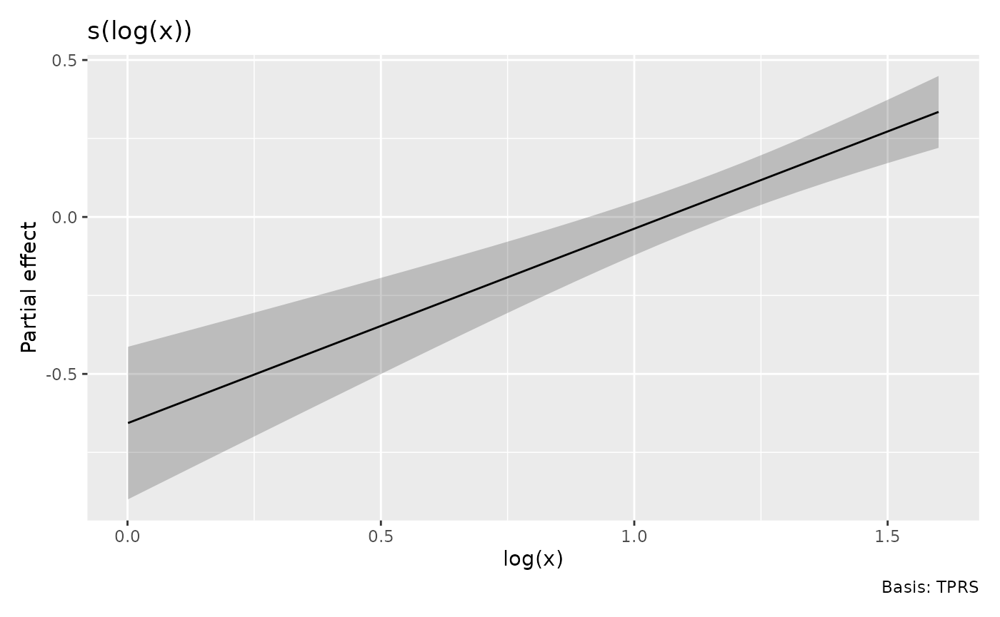

# Functions of covariates and evaluation environments

A smooth can depend on a function of a covariate rather than on the raw
covariate. The same distinction arises with offsets, such as logged
effort in a count model.

``` r

set.seed(42)
dat <- data.frame(x = runif(150, 1, 5), effort = runif(150, 1, 3))
dat$y <- rpois(nrow(dat), dat$effort * exp(sin(log(dat$x))))
m <- gam(y ~ s(log(x), k = 6) + offset(log(effort)),
  family = poisson(), data = dat, method = "REML")
```

## Raw data and smooth coordinates

Supply raw covariates to evaluate the model at new observations. Gratia
computes `log(x)` and, for full predictions, `offset(log(effort))`. An
isolated smooth does not require unrelated predictors or the model
offset.

``` r

nd <- data.frame(x = seq(1.2, 4.8, length.out = 8), effort = 2)
smooth_estimates(m, data = nd["x"])
#> # A tibble: 8 × 6
#>   .smooth   .type .by   .estimate    .se `log(x)`
#>   <chr>     <chr> <chr>     <dbl>  <dbl>    <dbl>
#> 1 s(log(x)) TPRS  NA      -0.544  0.107     0.182
#> 2 s(log(x)) TPRS  NA      -0.323  0.0748    0.539
#> 3 s(log(x)) TPRS  NA      -0.160  0.0543    0.801
#> 4 s(log(x)) TPRS  NA      -0.0318 0.0428    1.01 
#> 5 s(log(x)) TPRS  NA       0.0747 0.0396    1.18 
#> 6 s(log(x)) TPRS  NA       0.166  0.0425    1.33 
#> 7 s(log(x)) TPRS  NA       0.245  0.0487    1.46 
#> 8 s(log(x)) TPRS  NA       0.315  0.0561    1.57
fitted_values(m, data = nd)
#> # A tibble: 8 × 7
#>    .row     x effort .fitted    .se .lower_ci .upper_ci
#>   <int> <dbl>  <dbl>   <dbl>  <dbl>     <dbl>     <dbl>
#> 1     1  1.2       2    2.51 0.107       2.03      3.09
#> 2     2  1.71      2    3.13 0.0748      2.70      3.62
#> 3     3  2.23      2    3.68 0.0543      3.31      4.09
#> 4     4  2.74      2    4.18 0.0428      3.85      4.55
#> 5     5  3.26      2    4.65 0.0396      4.31      5.03
#> 6     6  3.77      2    5.10 0.0425      4.69      5.54
#> 7     7  4.29      2    5.52 0.0487      5.01      6.07
#> 8     8  4.8       2    5.92 0.0561      5.30      6.61
```

Automatic smooth grids are evenly spaced in the **smooth coordinate**,
here `log(x)`, and the output and plot axes use that name. They use
stored evaluated covariates, so they do not need to reconstruct an
inverse transformation.

``` r

sm <- smooth_estimates(m, n = 30)
draw(sm)
```



An explicitly evaluated column is also accepted:

``` r

evaluated <- data.frame(`log(x)` = log(nd$x), check.names = FALSE)
smooth_estimates(m, data = evaluated)
#> # A tibble: 8 × 6
#>   .smooth   .type .by   .estimate    .se `log(x)`
#>   <chr>     <chr> <chr>     <dbl>  <dbl>    <dbl>
#> 1 s(log(x)) TPRS  NA      -0.544  0.107     0.182
#> 2 s(log(x)) TPRS  NA      -0.323  0.0748    0.539
#> 3 s(log(x)) TPRS  NA      -0.160  0.0543    0.801
#> 4 s(log(x)) TPRS  NA      -0.0318 0.0428    1.01 
#> 5 s(log(x)) TPRS  NA       0.0747 0.0396    1.18 
#> 6 s(log(x)) TPRS  NA       0.166  0.0425    1.33 
#> 7 s(log(x)) TPRS  NA       0.245  0.0487    1.46 
#> 8 s(log(x)) TPRS  NA       0.315  0.0561    1.57
```

If raw inputs and evaluated columns are both supplied, expressions are
recomputed from the raw inputs. Stored model frames and automatically
prepared grids retain their evaluated coordinates.

[`data_slice()`](https://gavinsimpson.github.io/gratia/reference/data_slice.md)
works with raw variables. Supply reference `data` if the original raw
covariates cannot be recovered; transformed values are not renamed as
raw variables or automatically inverted.

``` r

data_slice(m, x = evenly(x, n = 8), effort = 2, data = dat)
#> # A tibble: 8 × 2
#>       x effort
#>   <dbl>  <dbl>
#> 1  1.00      2
#> 2  1.57      2
#> 3  2.13      2
#> 4  2.70      2
#> 5  3.26      2
#> 6  3.83      2
#> 7  4.39      2
#> 8  4.96      2
```

## Local functions

A fitted model may retain the formula expression without retaining the
local environment in which it was evaluated. Preserve that environment
when fitting if you will need a local function at new observations.

``` r

fit_local <- function(dat) {
  shift <- 0.5
  transform_x <- function(x) log(x + shift)
  f <- y ~ s(transform_x(x), k = 6) + offset(log(effort))
  list(model = gam(f, family = poisson(), data = dat, method = "REML"),
    envir = environment(f))
}
bundle <- fit_local(dat)
smooth_estimates(bundle$model, data = nd, envir = bundle$envir)
#> # A tibble: 8 × 6
#>   .smooth           .type .by   .estimate    .se `transform_x(x)`
#>   <chr>             <chr> <chr>     <dbl>  <dbl>            <dbl>
#> 1 s(transform_x(x)) TPRS  NA      -0.543  0.113             0.531
#> 2 s(transform_x(x)) TPRS  NA      -0.329  0.0772            0.795
#> 3 s(transform_x(x)) TPRS  NA      -0.164  0.0607            1.00 
#> 4 s(transform_x(x)) TPRS  NA      -0.0295 0.0511            1.18 
#> 5 s(transform_x(x)) TPRS  NA       0.0802 0.0451            1.32 
#> 6 s(transform_x(x)) TPRS  NA       0.170  0.0440            1.45 
#> 7 s(transform_x(x)) TPRS  NA       0.244  0.0497            1.57 
#> 8 s(transform_x(x)) TPRS  NA       0.308  0.0619            1.67
fitted_values(bundle$model, data = nd, envir = bundle$envir)
#> # A tibble: 8 × 7
#>    .row     x effort .fitted    .se .lower_ci .upper_ci
#>   <int> <dbl>  <dbl>   <dbl>  <dbl>     <dbl>     <dbl>
#> 1     1  1.2       2    2.51 0.113       2.01      3.13
#> 2     2  1.71      2    3.11 0.0772      2.67      3.62
#> 3     3  2.23      2    3.67 0.0607      3.26      4.13
#> 4     4  2.74      2    4.19 0.0511      3.79      4.64
#> 5     5  3.26      2    4.68 0.0451      4.28      5.11
#> 6     6  3.77      2    5.12 0.0440      4.70      5.58
#> 7     7  4.29      2    5.51 0.0497      5.00      6.08
#> 8     8  4.8       2    5.88 0.0619      5.21      6.64
```

Automatic smooth plots can still use stored `transform_x(x)` values
without this environment. New raw observations require the function.
Evaluation errors identify the expression and explain how to supply the
missing context; stored training values are never substituted for
arbitrary new observations.

## Which derivative?

For a contribution $`f(\log x)`$, the default derivative is with respect
to $`\log x`$. Set `wrt = "covariate"` to differentiate with respect to
$`x`$ instead. The latter includes the chain-rule factor $`1/x`$ because
the transformation is reevaluated after each perturbation of $`x`$.

``` r

derivatives(m, data = nd, type = "central")
#> # A tibble: 8 × 9
#>   .smooth   .by   .fs   .derivative   .se .crit .lower_ci .upper_ci `log(x)`
#>   <chr>     <chr> <chr>       <dbl> <dbl> <dbl>     <dbl>     <dbl>    <dbl>
#> 1 s(log(x)) NA    NA          0.620 0.101  1.96     0.422     0.817    0.182
#> 2 s(log(x)) NA    NA          0.620 0.100  1.96     0.423     0.817    0.539
#> 3 s(log(x)) NA    NA          0.620 0.100  1.96     0.423     0.816    0.801
#> 4 s(log(x)) NA    NA          0.620 0.100  1.96     0.423     0.816    1.01 
#> 5 s(log(x)) NA    NA          0.620 0.100  1.96     0.423     0.816    1.18 
#> 6 s(log(x)) NA    NA          0.620 0.100  1.96     0.423     0.816    1.33 
#> 7 s(log(x)) NA    NA          0.619 0.101  1.96     0.422     0.816    1.46 
#> 8 s(log(x)) NA    NA          0.619 0.101  1.96     0.422     0.817    1.57
derivatives(m, data = nd, type = "central", wrt = "covariate")
#> # A tibble: 8 × 9
#>   .smooth   .by   .fs   .derivative    .se .crit .lower_ci .upper_ci     x
#>   <chr>     <chr> <chr>       <dbl>  <dbl> <dbl>     <dbl>     <dbl> <dbl>
#> 1 s(log(x)) NA    NA          0.516 0.0839  1.96    0.352      0.681  1.2 
#> 2 s(log(x)) NA    NA          0.361 0.0586  1.96    0.247      0.476  1.71
#> 3 s(log(x)) NA    NA          0.278 0.0450  1.96    0.190      0.366  2.23
#> 4 s(log(x)) NA    NA          0.226 0.0366  1.96    0.154      0.298  2.74
#> 5 s(log(x)) NA    NA          0.190 0.0308  1.96    0.130      0.251  3.26
#> 6 s(log(x)) NA    NA          0.164 0.0266  1.96    0.112      0.216  3.77
#> 7 s(log(x)) NA    NA          0.145 0.0235  1.96    0.0986     0.191  4.29
#> 8 s(log(x)) NA    NA          0.129 0.0209  1.96    0.0880     0.170  4.8
```

For a smooth of several raw inputs, such as `s(I(x / z))`, name the raw
`focal` variable explicitly. Other inputs are held at the supplied
values, or at typical values when generating a slice. Use
[`I()`](https://rdrr.io/r/base/AsIs.html) for arithmetic that R would
otherwise interpret as formula syntax. For tensor smooths, use
[`partial_derivatives()`](https://gavinsimpson.github.io/gratia/reference/partial_derivatives.md)
and specify the smooth or raw focal coordinate consistently with `wrt`:
**`wrt` chooses the differentiation scale, and `focal` names the
coordinate to differentiate along on that scale**.

For example, `te(log(x), sqrt(z))` represents a contribution
$`f(\log x, \sqrt z)`$. The two choices have the following meanings:

| Arguments | Derivative |
|:---|:---|
| `wrt = "smooth", focal = "log(x)"` | With respect to $`\log x`$, holding $`\sqrt z`$ fixed |
| `wrt = "covariate", focal = "x"` | With respect to $`x`$, holding $`z`$ fixed |

``` r

set.seed(43)
tensor_dat <- data.frame(x = runif(150, 1, 5), z = runif(150, 1, 3))
tensor_dat$y <- sin(log(tensor_dat$x)) * sqrt(tensor_dat$z) +
  rnorm(nrow(tensor_dat), sd = 0.1)
tensor_model <- gam(y ~ te(log(x), sqrt(z), k = c(4, 4)),
  data = tensor_dat, method = "REML")

# Vary x along a slice with z held fixed.
tensor_nd <- data.frame(x = seq(1.2, 4.8, length.out = 8), z = 2)
pd_smooth <- partial_derivatives(tensor_model, data = tensor_nd,
  wrt = "smooth", focal = "log(x)", type = "central")
pd_covariate <- partial_derivatives(tensor_model, data = tensor_nd,
  wrt = "covariate", focal = "x", type = "central")

# Compare the raw-covariate derivative with the chain-rule calculation.
data.frame(x = tensor_nd$x,
  covariate_derivative = pd_covariate$.partial_deriv,
  smooth_derivative_over_x = pd_smooth$.partial_deriv / tensor_nd$x)
#>          x covariate_derivative smooth_derivative_over_x
#> 1 1.200000           1.10743950               1.10743950
#> 2 1.714286           0.70406919               0.70406919
#> 3 2.228571           0.46255744               0.46255744
#> 4 2.742857           0.30372264               0.30372264
#> 5 3.257143           0.19160164               0.19160164
#> 6 3.771429           0.11442885               0.11442885
#> 7 4.285714           0.07550389               0.07550389
#> 8 4.800000           0.05874753               0.05874753
```

The first call perturbs `log(x)` directly. The second perturbs `x` and
recomputes the smooth expressions, incorporating the chain rule
numerically. Thus, for these first derivatives,
$`\partial f / \partial x = (\partial f / \partial \log x) / x`$, up to
finite-difference approximation error.

In
[`partial_derivatives()`](https://gavinsimpson.github.io/gratia/reference/partial_derivatives.md),
`wrt = "smooth"` is the default, and omitting `focal` selects the first
non-factor smooth coordinate. With `wrt = "covariate"`, supply `focal`
whenever several raw covariates are eligible; for this tensor smooth,
choose `"x"` or `"z"`. If selecting several smooths, supply one `focal`
per smooth in their selected order; the same `wrt` applies to all of
them.

Supplied `data` should describe a slice with the other independent
numeric inputs held fixed, as `z` is above. Raw-scale differentiation
requires the raw focal column: stored transformed values alone are
insufficient. For an untransformed coordinate such as `x` in `te(x, z)`,
both choices of `wrt` give the same interpretation.

### Choosing a finite-difference step

The derivative functions use `eps = NULL` by default to choose a step
from the fitted range of the differentiation coordinate. This is the
range of `log(x)` when differentiating on that smooth coordinate, or of
`x` when using `wrt = "covariate"`. The step therefore follows changes
in the covariate’s units and normally stays the same when prediction
data are split into batches.

For derivative order $`d`$, the range is multiplied by
$`\epsilon_{\mathrm{machine}}^{1/(d+p)}`$, where $`p=2`$ for central
differences and $`p=1`$ for forward or backward differences. This
balances the orders of rounding and approximation error; for example,
second central differences use the fourth root of machine precision.
Constant coordinates use their magnitude instead of their range, with a
fallback of one at zero. A lower bound and rounding of the step ensure
representable perturbations at large coordinates.

This rule does not estimate a universally optimal step: that would also
need information about higher derivatives of the fitted function. Very
small steps can amplify rounding errors, particularly for second
derivatives, while large steps increase approximation error. For unusual
function scales or domain boundaries, supply a positive absolute `eps`
and check stability at nearby step sizes. See the [FiniteDiff step-size
discussion](https://docs.sciml.ai/FiniteDiff/dev/epsilons/) for the
error-balance principle.
